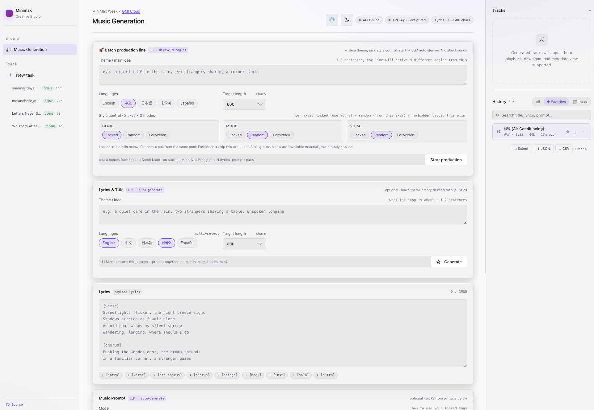

# minimax music studio

A single-page web app for generating music with the [Minimax Music 3.0](https://docs.gmicloud.ai/model-quickstarts/audio/minimax-music-3-0) model on GMI Cloud. Write a theme, get 1 to 100 songs. Every track is saved to a local library you can search, replay, and download.

Built by **Everclaw Agent** on top of the **MiniMax M3** model.

> Chinese version: see [README.zh-CN.md](./README.zh-CN.md).



## What you can do

- **Batch generation (1 to 100 tracks per click)** — type a theme, pick how many songs, press one button. Each track gets its own lyrics and music prompt written by an LLM, then its own audio. A real-time progress bar shows what is happening.
- **One Generate button does it all** — the LLM drafts a song title, lyrics, and a music-prompt description in a single call. You can then apply them to the form, or keep typing your own.
- **Local library** — every successful track is saved in your browser (IndexedDB). Search by title or lyrics, mark favorites, soft-delete to trash, export as ZIP / JSON / CSV. The audio is cached as a blob the moment it finishes, so downloads work offline.
- **Resume after crash** — refresh the page mid-batch and the unfinished tracks pick up from where they left off.
- **Session history** — every successful generate auto-saves an input snapshot. Click any entry to refill the form.
- **Real audio download** — the per-track Download button and the library per-item download both deliver the actual MP3/WAV bytes, plus a sidecar lyrics file.
- **Settings page** — API key, model choice, and both endpoint URLs. Live reachability check on every URL field. One-click "Test all settings" runs the whole pipeline and tells you what passed.
- **Dark / light / system theme** — the theme button cycles the three. First visit follows your OS preference.
- **Chinese / English UI** — the language button cycles both. First visit follows your browser primary language.

## Quick start

You need **Node.js 18 or newer**. Nothing else. No `npm install`, no build step.

### 1. Get the project on your machine

```bash
git clone https://github.com/snekkenull/minimax-music-studio.git
cd minimax-music-studio
```

If you don't have Git, click the green **Code** button on the GitHub repo page and choose **Download ZIP**, then unzip and `cd` into the folder.

### 2. Start the studio

- **macOS** — double-click `start.command`
- **Windows** — double-click `start.bat`
- **Linux** — run `./start.sh` from a terminal

The launcher checks Node, starts the local proxy, and opens the studio in your default browser. If Node is missing, the launcher prints the exact install command for your platform (Homebrew, apt, dnf, winget, Chocolatey, or the official download page) and stops, so you can install it and try again.

Press `Ctrl+C` in the launcher window to stop the proxy.

## First run

1. Click the **gear icon** in the top-right of the studio. The Settings page opens.
2. Paste your **API key** from [GMI Cloud](https://console.gmicloud.ai/ref/5VHEBA7F). The key lives only in your browser local storage; it is never sent anywhere except GMI Cloud.
3. The music model (`minimax-music-3.0`) and the LLM model are pre-filled. Change them only if you know what you are doing.
4. Click **Save**. You bounce back to the studio.
5. Type a theme in the **Production line** card (for example "rainy Tokyo café, lo-fi jazz, English lyrics"). Pick a count (1 to 100) and press **Start production**.

Tracks start appearing in the right pane and the **Library** tab as they finish. Click any track to play it, or use the download button to save the MP3 and a sidecar lyrics file.

## Use it like a normal app

| You want to | Do this |
| --- | --- |
| Generate one song with custom lyrics | Fill the Lyrics + Prompt textareas, leave Title empty, press **Generate** |
| Generate N songs from one theme | Use the **Production line** card, set a count, press **Start production** |
| Use the LLM to draft a song package | Click **Generate** (the lyrics/prompt can still be edited after Apply) |
| Hear a track again | Click its row in the **Library** tab, press Play |
| Save the audio file | Click the download icon on the track row or in the right-pane preview |
| Find a track you made last week | Use the search box in the Library tab (searches titles and lyrics) |
| Empty the trash | Library tab → Trash → Empty trash |
| Change the API key | Top-right gear icon |
| Switch language | Top-right globe icon (zh ⇄ en) |
| Switch theme | Top-right sun/moon icon (dark ⇄ light ⇄ system) |
| Stop the local server | Press Ctrl+C in the terminal window |

## Architecture in 30 seconds

This is a **zero-build** project. The whole app is plain HTML, CSS, and vanilla JavaScript modules — no bundler, no transpiler, no `package.json`. The only server-side piece is `proxy.js`, a small Node script that:

1. Serves the static files (`music-generator.html`, `settings.html`, `js/*.js`, `theme.css`, `lib/idb-keyval.min.js`) from this directory.
2. Forwards every `/api/*` request to `https://console.gmicloud.ai/api/*`.
3. Injects CORS headers so the browser (which is at `http://127.0.0.1:8787/`) can reach the upstream (which is at `https://console.gmicloud.ai/`) without the browser dropping the request.

The proxy is **required**. GMI Cloud API does not return CORS headers, so a direct browser fetch fails with `TypeError: Failed to fetch` before the request ever reaches authentication. The proxy terminates CORS locally and pipes the request through.

### Why no build step?

Every module is a plain `<script>` tag in `music-generator.html` and `settings.html`. Each module wraps itself in an IIFE and self-registers on the `window.MusicStudio` namespace, in load order. Edit a `.js` file, hit reload, see the change. There is no separate "dev server" and "production server" — the proxy is both.

### Where is my data?

Everything is in your browser, on your machine. There is no central server, no account, no telemetry.

| What | Where |
| --- | --- |
| API key | `localStorage` (browser-only) |
| Form contents (so a refresh does not lose your typing) | `localStorage` |
| In-flight batch (so the app can resume after a crash) | IndexedDB |
| Saved tracks (metadata + audio bytes) | IndexedDB |
| Recent input history | IndexedDB |

To wipe everything, open the browser DevTools console and run:

```js
indexedDB.deleteDatabase('minimax-metadata');
indexedDB.deleteDatabase('minimax-blobs');
indexedDB.deleteDatabase('minimax-sessions');
localStorage.clear();
```

Then refresh.

## Configuration

| Env var | Default | Purpose |
| --- | --- | --- |
| `PORT` | `8787` | TCP port the local proxy listens on. Change it if 8787 is taken. |
| `HOST` | `127.0.0.1` | Bind address. Localhost-only by default. Do not change unless you know why. |

Set them before running the launcher:

```bash
PORT=9000 ./start.sh              # macOS / Linux
$env:PORT = 9000 ; .\start.ps1    # Windows PowerShell
```

## Troubleshooting

**The launcher says "Node.js is not installed".**
Install Node.js 18 or newer:
- macOS: `brew install node@18` (or download from https://nodejs.org)
- Linux: `sudo apt install nodejs npm` (Ubuntu 20.04+) or use your distro package manager
- Windows: `winget install OpenJS.NodeJS.LTS` (or download from https://nodejs.org)

After installing, close and reopen the terminal, then re-run the launcher.

**"EADDRINUSE: address already in use :::8787".**
Another process is using port 8787. Either close it, or run the launcher with a different port: `PORT=9000 ./start.sh`.

**"API Key 未配置" (API key not configured).**
Click the gear icon in the top-right of the studio, paste your GMI Cloud API key, and Save. Keys from https://console.gmicloud.ai/ref/5VHEBA7F start with `mock_` for the free tier.

**"HTTP 401" or "鉴权失败" (auth failed) in the API key chip.**
The key is invalid, expired, or not yet activated. Generate a new one on the GMI Cloud console.

**The browser opens but the page is blank.**
Check the terminal window where the launcher is running — the proxy logs every request. If you see `404` for `js/*.js`, the launcher is running from the wrong directory; the scripts auto-walk up to find `proxy.js` but in some sandboxes (Docker with bind mounts, etc.) the walk can fail. Run it from inside the extracted folder.

**The library shows tracks I made weeks ago but the new ones do not appear.**
IndexedDB quotas vary by browser. Open DevTools → Application → Storage → IndexedDB and check the quota. If you are at the limit, export the library to JSON (Library tab → Export), empty the trash, then paste the JSON back via Import.

## Project layout

```
minimax-music-studio-0.2.0/
├── proxy.js                  # Node CORS proxy + static server
├── music-generator.html      # Main studio page
├── settings.html             # Settings page
├── theme.css                 # Dark / light / system tokens
├── js/                       # 12 vanilla JS modules (no bundler)
├── lib/idb-keyval.min.js     # Tiny IndexedDB key/value helper
├── scripts/release/          # Cross-platform one-click launchers
│   ├── start.command         # macOS Finder double-click
│   ├── start.sh              # macOS + Linux terminal
│   ├── start.bat             # Windows double-click
│   ├── start.ps1             # Windows PowerShell
│   └── README.txt            # One-page user doc
├── README.md                 # this file
├── README.zh-CN.md           # Chinese version
└── VERSION                   # 0.2.0
```

## Thanks

This project is built on **Everclaw Agent** and the **MiniMax M3** model, **GMI Cloud** provider.
